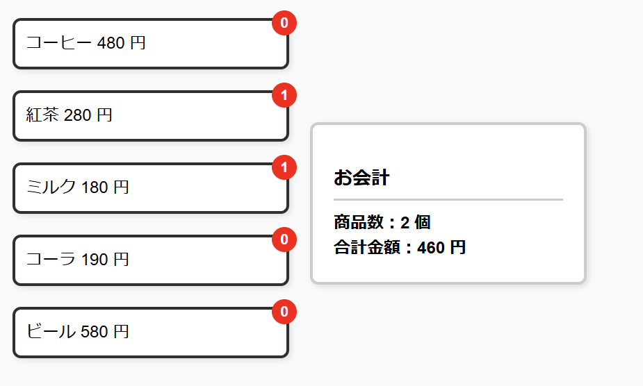

# Track-cafe

## Technologies Used
- **React**: Frontend library for building the UI.
- **TypeScript**: Ensures type safety and better code maintainability.
- **Jest & React Testing Library**: For unit and integration testing.
- **CSS Modules**: Manages component-specific styles.

## Getting Started
1. Install dependencies:
   ```bash
   yarn install
   ```
2. Start
   ```bash
   npm start
   ```
3. Run tests
   ```bash
   npm test
   ```



